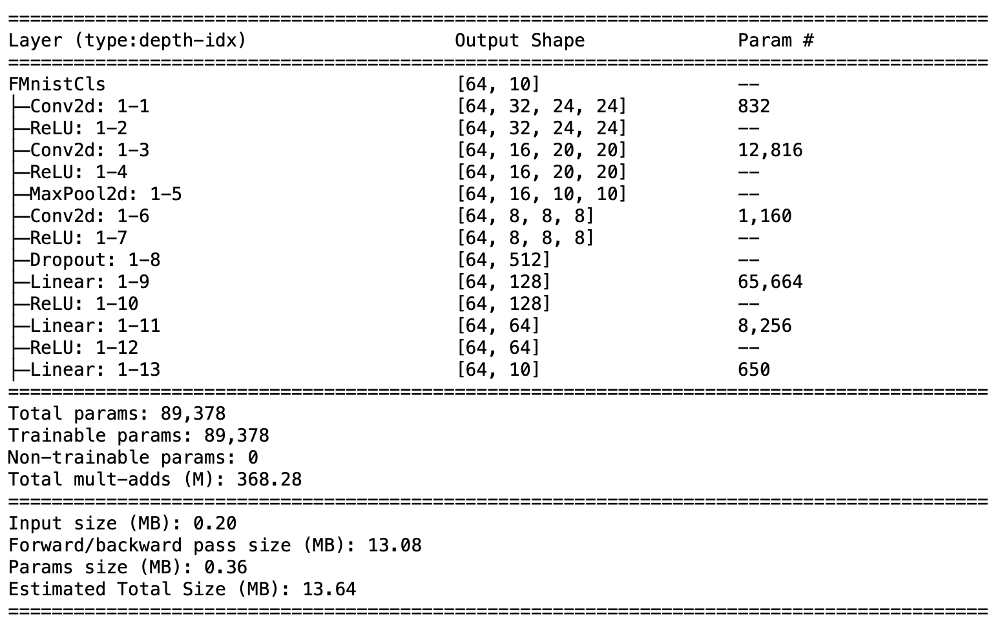
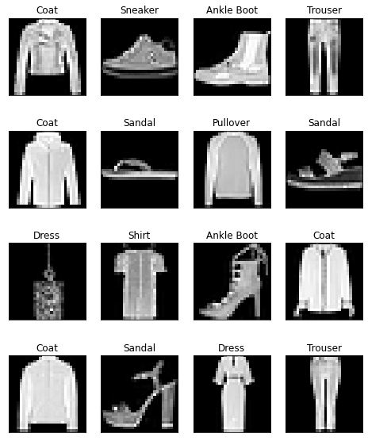
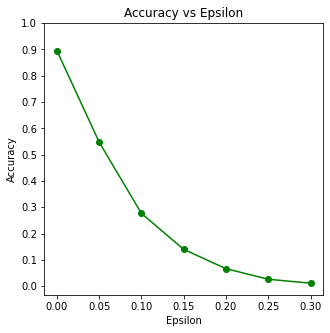
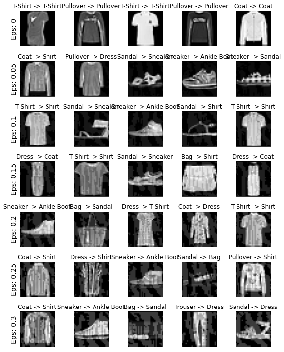

# FGSM_FashionMnist

## Implementation Fast Gradient Sign Method (FGSM) to generate adversarual example.
  
### dataset: Fashion MNIST
  
## Treat model:

 

accuracy: 89.49%

  

## Implement FGSM

